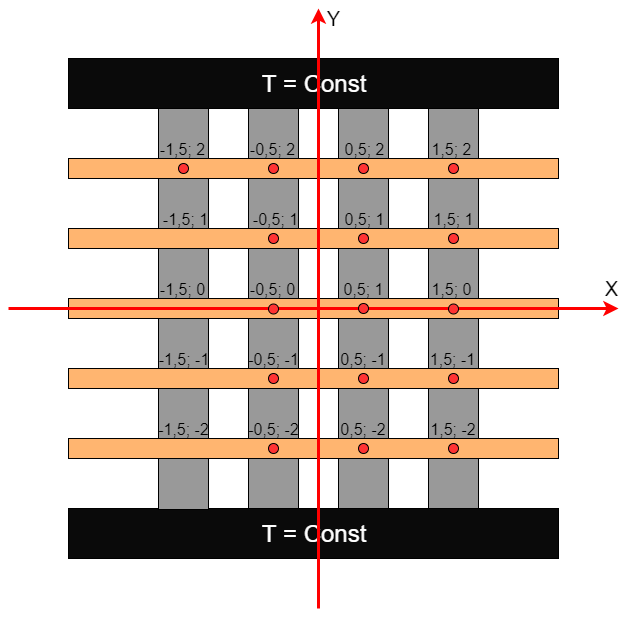
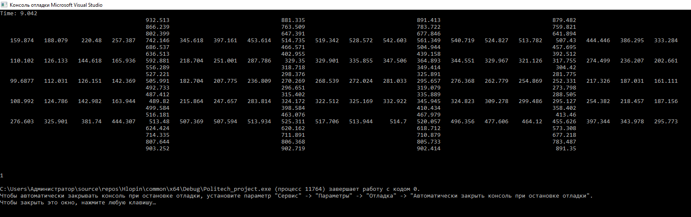
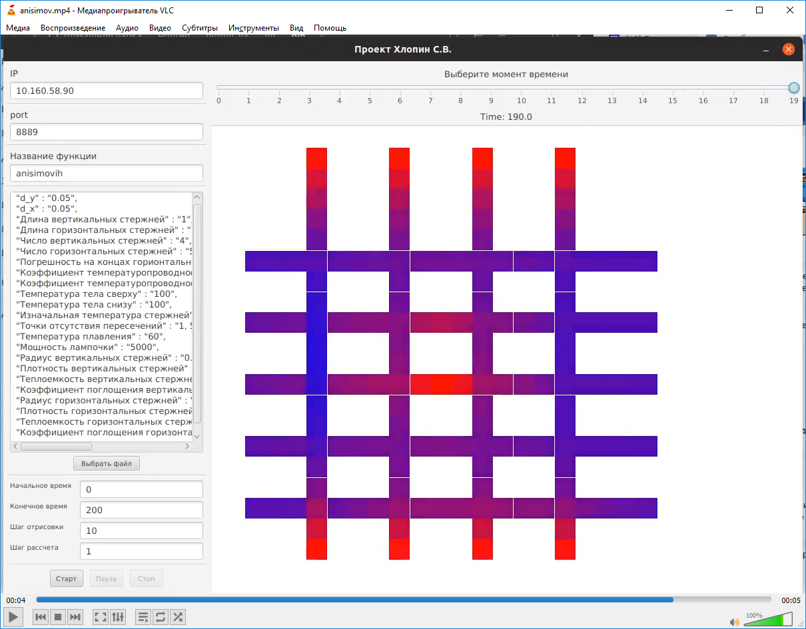

# 1 Постановка задачи
Целью данной работы является моделирование процесса нагревания сетки стержней, пересекающихся в заданных точках.
Тела сверху и снизу поддерживаются при постоянной температуре. Границы горизонтальных стержней сохраняют изначальную температуру, имитируя бесконечный стержень.
В центре находится излучатель, нагревающий стержни.
 
 Более подробное математическое описание задачи можно посмотреть в файле [Physical_explanations.pdf](Docs/Physical_explanations.pdf).

# 2 Программа
Программа, производящая рассчеты находится в дериктории [Module_for_cluster](Module_for_cluster).

Для запуска требуется ввести следующий параметры в метод “parseParam”:
 * d_x
 * d_y
 * t_step
 * Длина вертикальных стержней
 * Длина горизонтальных стержней
 * Число вертикальных стержней
 * Число горизонтальных стержней
 * Коэффициент температуропроводности вертикальных стержней
 * Коэффициент температуропроводности горизонтальных стержней
 * Температура тела сверху
 * Температура тела снизу
 * Погрешность на концах горионтальных стержней
 * Изначальная температура стержней
 * Точки отсутствия пересечений
 * Мощность лампочки
 * Радиус вертикальных стержней
 * Плотность вертикальных стержней
 * Теплоемкость вертикальных стержней
 * Коэффициент поглощения вертикальных стержней
 * Радиус горизонтальных стержней
 * Плотность горизонтальных стержней
 * Теплоемкость горизонтальных стержней
 * Коэффициент поглощения горизонтальных стержней

После этого следует вызвать метод nextStep необходимое число раз.
Для вывода результатов в консоль слудукт вызвать метод print_picture.
В результате получаем набор чисел, описывающий температуры стержня во всех точках:

# 3 График изменения температур
Для построения графика используется [скрипт Python](Gif_maker).

Программа берет данные из csv файлов, поэтому сначала необходимо запустить метод print_to_csv из основной программы. В результате работы программы получаем следующую анимацию:

# 4 Запуск на кластере
Для обработки расчётов на кластере, коллеги разработали отдельный комплекс программ.
На следующем скриншоте продемонстрирован результат работы интерфейса, отображающего данные, принятые с кластера.

# 5 Заключение
В ходе выполнения данной работы на основе математической модели и ее начальных и граничных условий была написана программа расчета температуры стержней в течение заданного промежутка времени.
На основе полученных данных была создана анимация, отображающая данный процесс.
